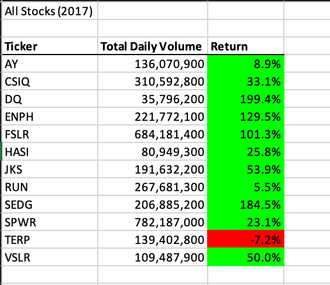
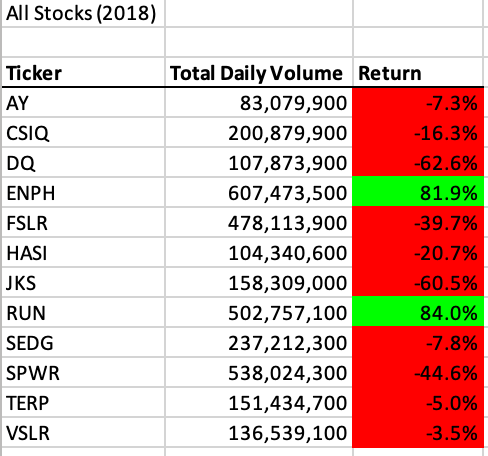
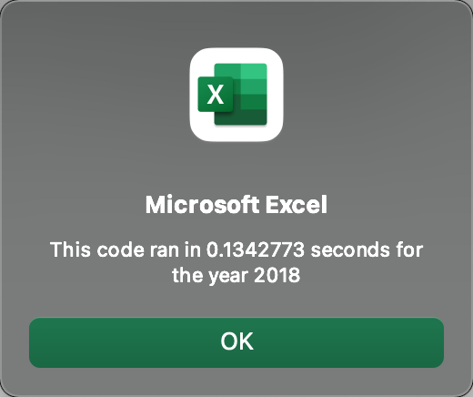

# Stock Analysis with Excel VBA 

## Overview of Project

### Purpose
The purpose of this project is to understand and analyse the performance of certain stocks in the year 2017 and 2018 and determine if they are worth the investment. One essential part for this project is to refactor the existing code such that we can loop through more than just a handful of stock data efficiently in order to understand the performance. 

### Background information
The goal of this project is to get the total daily volume and the return of 12 different stocks in the year 2017 and 2018 efficiently. Based on the information for these 12 stock's performance in 2018 and 2017 we can determine which stock is a good stock to invest in.

## Result

### A comparison of stock performance between 2017 and 2018
Comparing all the stocks side by side between 2017 and 2018 it is cear that ENPH abd RUN are good stocks to invest in. 

Stock Performance for the year 2017:

Stock Performance for the year 2018:

### Time taken to execute original versus refactored VBA script
Time taken to run this script between the original and refactored VBA script is quite significant.

Below are some images that elaborates on this. These images are of a pop up modal that shows the time to execute the VBA script for each year.

2017 Original Code : 

2017 Refactored Code :

2018 Original Code :

2018 Refactored Code :

From these images it is clear that time taken to execute refactored VBA script is much faster, thus proving that refactored code is working more efficiently. 

## Summary
### Advantage of refactoring code

Advantage of refactoring any code is that it increases code performance and decreases the execution time. Refactoring also clears and removes any unnecessary codes and makes the code easier to understand and read. 

### Disadvantage of refactoring code

There are some limited disadvantage of refactoring a code. When a code is refactored, we must also check any unit tests or automation test cases that may have been broken as a result. We will have to make sure none of the test cases are failing due to any changes. 

### Advantage and disadvantage of the original VBA script

#### Advantage
The original script was able to give the proper result.

#### Disadvantage
However, the time taken to execute the script was really long resulting in a poor performance.

### Advantage and disadvantage of the refactored VBA script

#### Advantage
The refactored script performance was much better and the execution time was approximately only 0.16 seconds.

#### Disadvantage
Currently, there is no disadvantage of the refactored code. 
